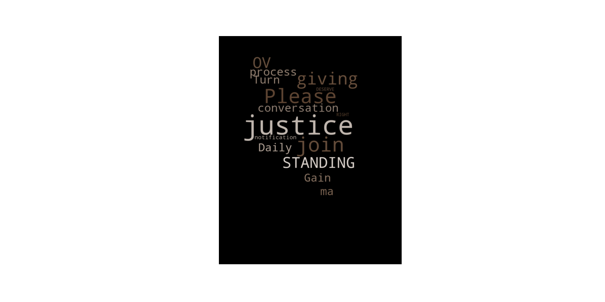
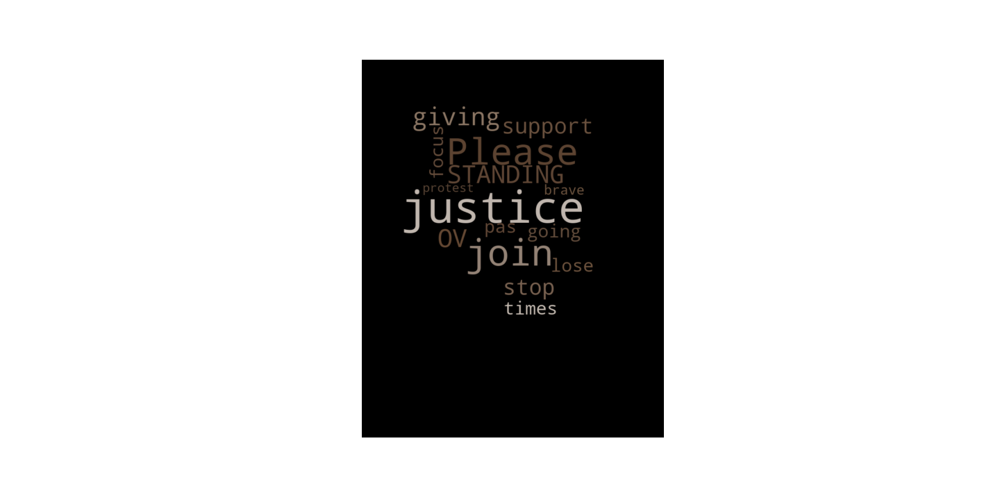
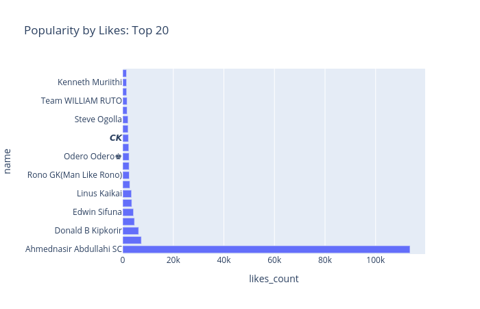
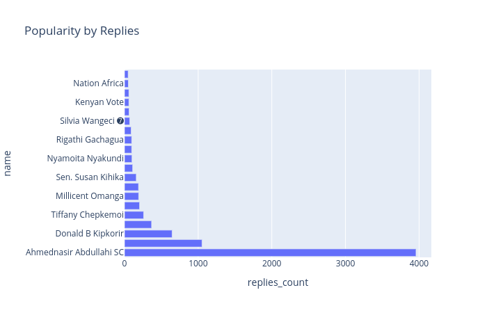
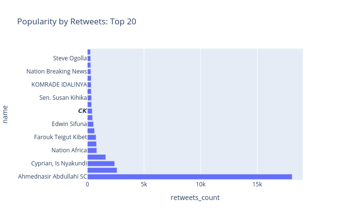

```{r setup, include=FALSE}
library(flexdashboard)
library(shiny)
library(dplyr)
library(plotly)
library(wordcloud)
library(RColorBrewer)
library(wordcloud2)
library(DT)
library(knitr)
```

```{r data}
data <- read.csv('bbi_data.csv')
```
```{r}
#Finding the hourly tweets counts
new_df <- data%>%group_by(hour, clean_text)%>%summarise(count=n())
hourly_tweets <- select(new_df, hour, count)
hourly_tweet_count = aggregate(hourly_tweets$count, list(hourly_tweets$hour), sum)
hourly_tweet_count <- data.frame(hourly_tweet_count)
colnames(hourly_tweet_count) <- c('hour', 'tweet_count')
#finding the user frequency in our data
users <- table(data$username)
users_dist <- data.frame(users)
colnames(users_dist) <- c("username", "Freq")
users_dist <- users_dist[with(users_dist, order(-Freq)),]
top_ten <- users_dist[1:10,]
#finding the average sentiment per hour
hourly_mean_sentiments <- aggregate(cbind(sentiment_score, pos_score, neg_score) ~hour, data=data, FUN=mean)
#colnames(hourly_sentiments) <- c("Hour", "mean_sentiment")
#hourly positive score
hourly_pos_score <- aggregate(data$pos_score, 
                              list(data$hour), mean)
hourly_pos_score <- data.frame(hourly_pos_score)
#hourly negative score
hourly_neg_score <- aggregate(data$neg_score, 
                              list(data$hour), mean)
hourly_neg_score <- data.frame(hourly_neg_score)
#user mean sentiment
user_mean_sentiment <- aggregate(data$sentiment_score, list(data$username), mean)
user_average_sent <- data.frame(user_mean_sentiment)

```
```{r}
#setting the colors
number_of_tweets <- "purple"
number_of_users <- "black"
mean_sentiment_score <- "red"
number_of_days <- "green"
```


Politics Summary
==================================================

Column 1
--------------------------------------------------

### Number of tweets {.value-box}
```{r}
#number of tweets value box
valueBox(value=paste(format(nrow(data), big.mark=","), "", sep = " "), 
         caption="Total number of tweets", color=number_of_tweets)
```

### Number of Users {.value-box}
```{r}
#number of locations present in the data
valueBox(value=paste(format(length(unique(data$username)), big.mark = ","), "", sep=" "), 
         caption="Number of users represented in the data", 
         color=number_of_users)
```


### Average Daily Sentiment {.value-box}
```{r}
#average sentiment score of the day
valueBox(value=paste(format(mean(data$sentiment_score), big.mark = ","), "", sep=" "), 
         caption = "Today's average sentiment",
         color=mean_sentiment_score)
```


Column 2
--------------------------------------------------------

### Words in Most Liked Tweets

```{r}

```

Column 3
--------------------------------------------------

### Words in Commonly Replied Tweets

```{r}

```

### Words in Commonly Retweeted Tweets

```{r}

```


Hourly Trends
===================================================
Column 1
---------------------------------------------------
### Tweets per Hour
```{r}
plotly::plot_ly(hourly_tweet_count, x=~hour, y=~tweet_count, 
                type='scatter', mode='lines', 
                name="Hourly tweeting trends")
```

Column 2
-----------------------------------------------------

### Top 10 Tweeting Accounts
```{r}
options(repr.plot.width=8, repr.plot.height=3)
ggplot(top_ten, aes(x = username, y = Freq)) +
         geom_bar(stat = "identity") +
         coord_flip() + scale_y_continuous(name="Frequency of occurrence)") +
  scale_x_discrete(name="Start Station") +
theme(axis.text.x = element_text(face="bold", color="#008000",
                           size=8, angle=0),
          axis.text.y = element_text(face="bold", color="#008000",
                           size=8, angle=0))
```


```{r}
mean_sentiments_per_hour <- data.frame(hourly_mean_sentiments)
```


How are people feeling?
========================================================

Column 1
---------------------------------------------------------
### Average Sentiment Per Hour
```{r}
plotly::plot_ly(mean_sentiments_per_hour, x=~hour, y=~sentiment_score, type='scatter', mode='lines', color="green", name="Compound Score")%>%
  add_trace(mean_sentiments_per_hour,  y=~pos_score, type="scatter", mode="lines", color="#fb5607", name="Positivity score" )%>%
  add_trace(mean_sentiments_per_hour, y=~neg_score, 
            type="scatter", mode="lines", name="Negativity sore")

```

Column 2
---------------------------------------------------------

### Sentiment Proportions among People
```{r}
#mean_compound_score <- mean(mean_sentiments_per_hour$sentiment_score)
mean_pos_score <- mean(mean_sentiments_per_hour$pos_score)
mean_neg_score <- mean(mean_sentiments_per_hour$neg_score)
plot_ly(values=c(mean_pos_score, mean_neg_score), labels=c("Positive", "Negative"), type="pie")
```


People's Popularity 
=============================================================================

### User Popularity by Likes

```{r}

```

Column 3
--------------------------------------------------

### User Popularity by Retweets

```{r}

```

### User Popularity by Replies

```{r}

```


